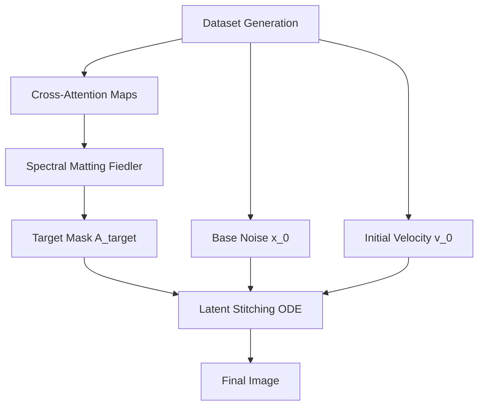

# FlowStitch

Unsupervised latent decomposition and stitching in Flow Matching models (FLUX.1).

This project explores zero-shot semantic injection — transplanting objects from one generation into another scene by manipulating the ODE velocity field during inference. It implements Kinetic Trajectory Shaping (KTS) and Graph-based Spectral Matting.

## Architecture



## Structure

- `flowstitch/`: Core python package
  - `core/`: Config and hooking logic
  - `extraction/`: Mask extraction (Attention, Spectral, Energy, Hybrid, TDA)
  - `stitching/`: ODE Perturbation, KTS, EMA Smoothing
  - `evaluation/`: DICE, IoU, CLIPScore metrics
  - `pipelines/`: End-to-end execution scripts
- `hpc_cluster/`: HPC Slurm scripts and entrypoints
- `local_analysis/`: Jupyter notebooks for exploratory analysis
- `docs/`: LaTeX thesis and research documents

## Setup

### 1. Install Package
```bash
# Basic installation
pip install -e .

# HPC installation (with bitsandbytes for quantization)
pip install -e ".[hpc]"

# Dev installation
pip install -e ".[dev]"
```

### 2. HPC Usage
```bash
cd hpc_cluster
sbatch run_dataset.sbatch
```

## References
- Flow Matching for Generative Modeling (Lipman et al., 2023)
- DiffCut: Zero-Shot Object Segmentation (Wu et al., 2024)
- FLUX.1 (Black Forest Labs, 2024)
